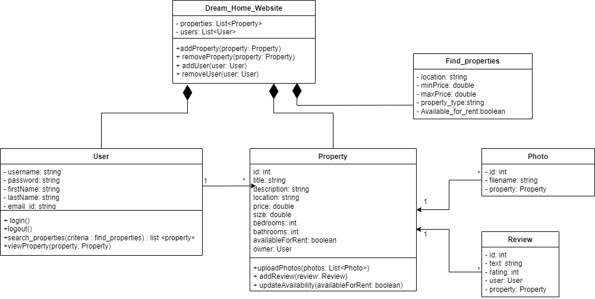

# Class Diagram

Welcome to the  Class Diagram section of the DreamHome Real Estate Website project! This document provides a comprehensive list of key concepts and terms that are essential to understanding and navigating our real estate platform.

 
## Contributing Members
| Sr. no. | Student Name | Student ID |
| --- | --- | --- |
| 1 | Akshita Srivastava | 202101117 |

## Table of Contents
- [Overview](#overview)
- [User Class](#User-Class)
- [Property Class](#Property-Class)
- [FindProperties Class](#FindProperties-Class)
- [Photo Class](#Photo-Class)
- [Review Class](#Review-Class)
- [Dream Home Website Class](#Dream-Home-Website-Class)
- [How to Use](#how-to-use)
- [Contributing](#contributing)
- [Contact](#Contact-us)

## Overview

The DreamHome Real Estate Website is a feature-rich platform designed to simplify property buying, selling, and renting. The following key concepts are integral to the functionality and user experience of our platform.

## User Class
The User class represents a registered user on the Dream Home Website. Users have the following attributes:

username: A string for the user's username.
password: A string for the user's password.
firstName: A string for the user's first name.
lastName: A string for the user's last name.
email id: A string for the user's email address.
Additionally, the User class has the following methods:

login(): Allows a user to log in to their account.
logout(): Allows a user to log out of their account.

## Property Class
The Property class represents properties listed on the Dream Home Website. Properties have the following attributes:

id: An integer representing the property's unique identifier.
title: A string for the property's title.
description: A string providing a description of the property.
location: A string indicating the property's location.
price: A double representing the property's price.
size: A double indicating the size of the property.
bedrooms: An integer representing the number of bedrooms in the property.
bathrooms: An integer representing the number of bathrooms in the property.
Properties also have the following attributes:

availableForRent: A boolean indicating whether the property is available for rent.
owner: A reference to the user who owns the property.
Additionally, the Property class has the following methods:

uploadPhotos(photos: List<Photo>): Allows photos to be uploaded for a property.
addReview(review: Review): Allows users to add reviews for a property.
updateAvailability(availableForRent: boolean): Updates the availability status of the property.

## FindProperties Class
The FindProperties class represents the criteria for searching properties on the Dream Home Website. It has the following attributes:

location: A string representing the desired location.
minPrice: A double indicating the minimum price for a property.
maxPrice: A double indicating the maximum price for a property.
property_type: A string specifying the property type (e.g., house, apartment).
Available_for_rent: A boolean indicating whether the property should be available for rent.

## Photo Class
The Photo class represents photos associated with a property. It has the following attributes:

id: An integer representing the photo's unique identifier.
filename: A string indicating the filename of the photo.
property: A reference to the property to which the photo belongs.

## Review Class
The Review class represents reviews provided by users for a property. It has the following attributes:

id: An integer representing the review's unique identifier.
text: A string containing the review text.
rating: An integer representing the rating given by the user.
user: A reference to the user who wrote the review.
property: A reference to the property being reviewed.

## Dream Home Website Class
The DreamHome_Website class represents the core of the Dream Home Website. It contains lists of properties and users and provides methods for managing these entities:

addProperty(property: Property): Adds a property to the website.
removeProperty(property: Property): Removes a property from the website.
addUser(user: User): Adds a user to the website.
removeUser(user: User): Removes a user from the website.
search_properties(criteria: FindProperties): list<Property>: Searches for properties based on the provided criteria.
viewProperty(property: Property): Allows users to view details of a specific property.

## How to Use

To understand the concept map:

1. Open the Class Diagram image in your preferred image viewer.
2. Explore the core concepts and their relationships within the DreamHome Real Estate Website ecosystem.
3. Use this image as a reference when discussing project architecture, features, and user interactions.

## Contributing

If you have suggestions for expanding or refining the concept map to include additional concepts or details, please feel free to contribute. Here's how:

1. Fork the repository.
2. Modify the concept map to reflect the changes or additions.
3. Update this README with details of your changes.
4. Submit a pull request.

## Contact Us

<ul>
We hope you find the DreamHome Real Estate Website platform useful for your real estate endeavors. If you have any questions or encounter any issues, please don't hesitate to contact us.

Mail id:- manan202101136@gmail.com 
</ul>

