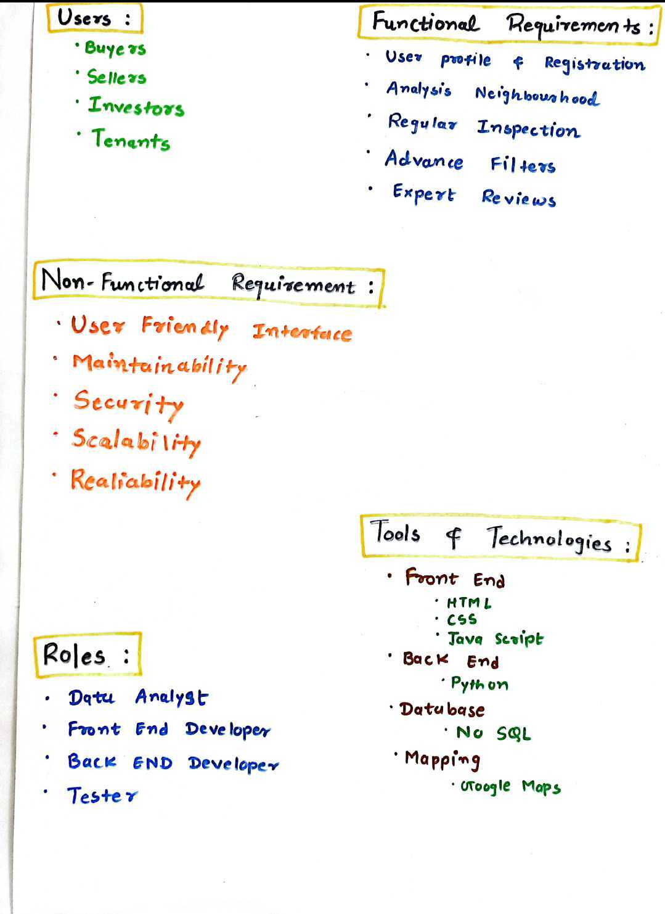
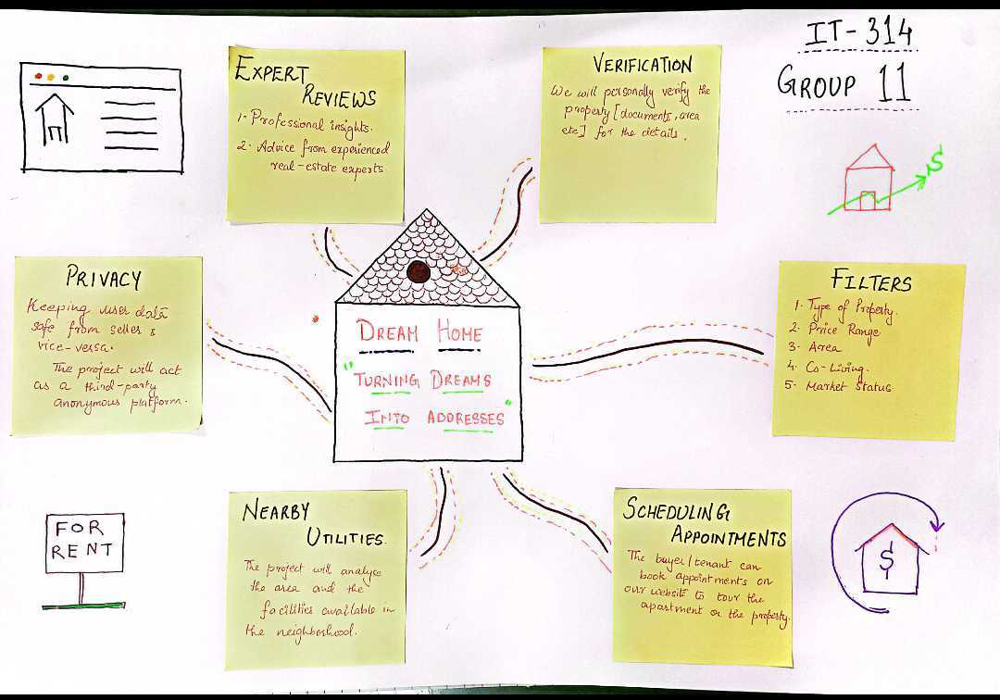
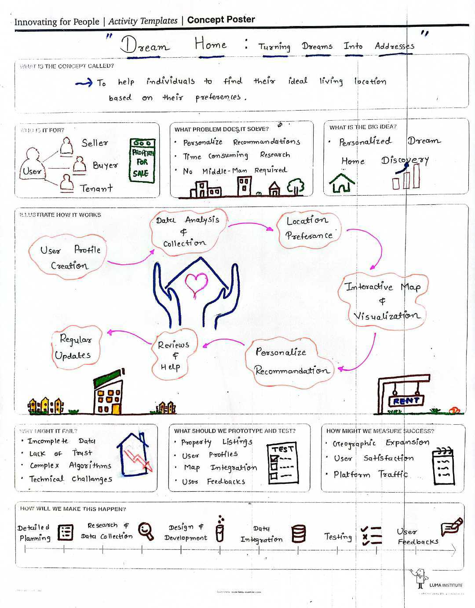
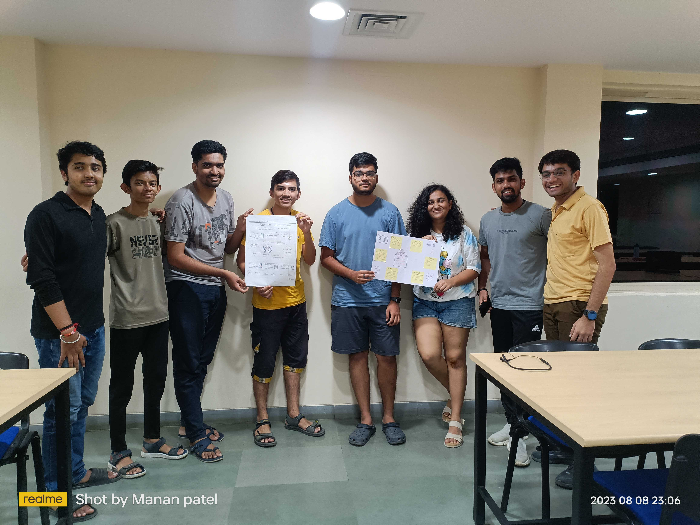

# Dream Home Real Estate Platform

Welcome to the Dream Home Real Estate Platform project! This README provides an overview of the project's functional and non-functional requirements, design thinking and features, and a concept poster.

# Contributing Members
| Sr. no. | Student Name | Student ID |
| --- | --- | --- |
| 1 | Manan Patel | 202101136 |
| 2 | Aum Patel | 202101118 |
| 3 | Akshita Srivastava | 202101117 |
| 4 | Aditya Prajapati | 202101133 |
| 5 | Jay Dobariya | 202101163 |
| 6 | Meet Dhorajiya | 202101155 |
| 7 | Dhruv Savaliya | 202101161 |
| 8 | Kushal Srivastava | 202101103 |

## Table of Contents
- [Functional and Non-Functional Requirements](#Functional-and-Non--Functional-Requirements)
- [Roles & Tools](#Roles-&-Tools)
- [Design Thinking and Features](#Design-Thinking-and-Features)
- [Concept Poster](#Concept-Poster)
- [Concept Overview](#Concept-Overview)
- [Prototyping and Testing](#Prototyping-and-Testing)
- [Potential Challenges](#Potential-Challenges)
- [Measuring Success](#Measuring-Success)
- [Project Phases](#Project-Phases)
- [How to Use](#How-to-Use)
- [Contributing](#contributing)
- [Contact](#Contact-us)
- [Group Image](#Group-Image)

## Functional and Non-Functional Requirements

### Users
- Buyers
- Sellers
- Investors
- Tenants

### Functional Requirements
- User profile & registration
- Neighbourhood analysis
- Regular inspection
- Advance filters
- Expert reviews

### Non-Functional Requirements
- User-friendly interface
- Maintainability
- Security
- Scalability
- Reliability

## Roles & Tools
- Data Analyst
- Front-end Developer
- Back-end Developer
- Tester

### Front End
- HTML
- CSS
- JavaScript
- React

### Back End
- Node.js With Express.js

### Database
- MongoDB

## Design Thinking and Features

### Expert Reviews
- Professional insights
- Advice from experienced real estate experts
- Verification of property documents and area details

### Privacy
- Keeping user data safe from sellers and vice versa
- The project acts as a third-party anonymous platform

### Filters
- Type of property
- Price range
- Area
- Co-Living
- Market status

### For Rent
- Nearby utilities
- Analyzing the area and facilities in the neighborhood

### Scheduling Appointments
- Buyers/tenants can book appointments on the website to tour properties

## Concept Poster

## Concept Overview

The concept of Dream Home is to help individuals find their ideal living location based on their preferences. It addresses the following:

- Personalized property recommendations
- No middle-man required
- Data analysis and location preference
- Regular updates and reviews
- Interactive map and visualization

## Prototyping and Testing

To ensure the success of the project, we will:
- Prototype and test user profiles
- Prototype and test property listings

## Potential Challenges

- Completeness of data
- Lack of trust
- Complex algorithms
- Technical challenges
- Map integration
- User feedback

## Measuring Success

We will measure success through:
- Geographic expansion
- User satisfaction
- Platform traffic

## Project Phases

1. Detailed research and planning
2. Data collection
3. Design and development
4. Database integration
5. Testing
6. User feedback

## How to Use

To effectively use the Dream Home Real Estate Platform:

1. Clone this repository to your local machine using `git clone`.
2. Set up the required tools and technologies mentioned in the "Tools & Technologies" section.
3. Run the project on your local environment for development or testing purposes.
4. Explore the different features and functionalities as described in the "Design Thinking and Features" section.
5. Provide feedback or report any issues by following the guidelines in the "Contributing" section.

## Contributing

We welcome contributions to the Dream Home Real Estate Platform project. If you'd like to contribute, please follow these steps:

1. Fork this repository.
2. Create a new branch for your contributions: `git checkout -b your-branch-name`.
3. Make your changes or additions to the project.
4. Commit your changes: `git commit -m "Add your contribution description"`.
5. Push your changes to your fork: `git push origin your-branch-name`.
6. Create a pull request to merge your changes into the main project repository.
7. We will review your contribution and merge it if it aligns with our project goals.

We appreciate your involvement in making the Dream Home Real Estate Platform a success!

## Contact Us
<ul>
We hope you find the DreamHome Real Estate Website platform useful for your real estate endeavors. If you have any questions or encounter any issues, please don't hesitate to contact us.
Mail id:- manan202101136@gmail.com 
</ul>

## Group Image

